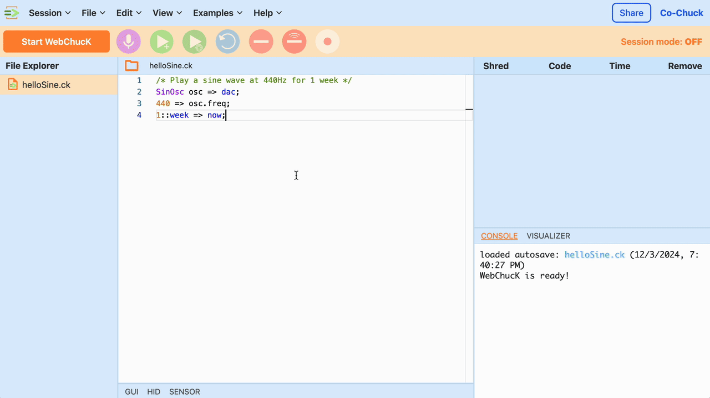

<p align="center">
  
</p>
<p align="center" style="font-size:20px;">
    <b>Co-Chuck: WebChucK IDE with Multi-User Collaboration and Synchronized ChucK Shreds</b>
</p>

<p align="center">
    
    
</p>

---

**Co-Chuck** is an enhanced version of the [WebChuck IDE](https://github.com/ccrma/webchuck-ide) that enables multi-user collaboration, concurrent code editing, and project file synchronization. It also synchronizes ChucK Shred playback across distributed devices, allowing users to collaboratively write and execute ChucK code directly in their browsers—just **like Google Docs, but for music/audio programming!**

This project builds upon [`ccrma/webchuck-ide` v2.1.4](https://github.com/ccrma/webchuck-ide/releases/tag/v2.1.4). Explore the links below to learn more about the projects that inspired and provided the foundation for Co-Chuck:

- [ChucK](https://chuck.stanford.edu)
- [WebChuck](https://chuck.stanford.edu/webchuck/)
- [WebChuck IDE](https://github.com/ccrma/webchuck-ide)

## Key Features

### User-level Features

- **Full WebChuck IDE**: Co-Chuck retains all the functionality of the original [WebChuck IDE](https://github.com/ccrma/webchuck-ide), a web-based integrated development environment (IDE) for real-time sound synthesis and music creation with [ChucK](https://chuck.stanford.edu).
- **Session Management**: Create, join, and close Co-Chuck sessions. Each session serves as a virtual "room" for up to 16 users to collaborate on a ChucK project. All you need is a username and a session ID.
- **File Synchronization**: Keep files synchronized across users in the same session. Actions such as creating, deleting, exploring, or modifying files (including adding examples) are instantly reflected for everyone. Files actively edited by another user are protected from deletion.
- **Real-Time Editor Sync**: Collaborate on a single file simultaneously. Co-Chuck uses [Myers's Difference Algorithm](https://neil.fraser.name/writing/diff/myers.pdf) and custom server-client mechanisms to perform conflict resolution in real-time.
- **File and Cursor Location Sync**: View the list of active users in the session, the file they are working on, and their current cursor position—similar to Google Docs.
- **Synchronized Shred Playback**: Play/stop synchronized ChucK Shreds across devices with a single button click. Co-Chuck implements a custom clock-synchronization mechanism to ensure precise playback timing (starts 1.5 seconds after the button is clicked).

### Technical Features

<p align="center">
    
</p>

- Production-ready full-stack deployment with NginX, Uvicorn, FastAPI, and Docker. The above diagram shows the overall service architecture.
- File, text, and user location synchronization through HTTP polling.
- Session state management, clock synchronization, and real-time user activity tracking with WebSocket.
- Automatic session clean-up, removing inactive users and sessions with no users.
- Custom network clock synchronization using WebSocket for synchronized Shred playback across multiple devices over the internet.
- FastAPI endpoints for creating, joining, and synchronizing sessions, adding, removing, and downloading files, managing projects, and broadcasting ChucK Shreds.
- In-memory session state management for fast sync (future plans to migrate to an external in-memory key-value store like Redis).
- New `SessionManager` and `SessionSystem` classes for session handling (located in `src/components/session`).

## Usage

<p align="center">
  
  <p align="center"><i>Sample screenshot of Co-Chuck</i></p>
</p>

---

Here are a few usage examples of Co-Chuck.

- **Create a New Session**: Start a new session and obtain a session ID to share with collaborators.

<p align="center">
  
</p>

- **Join an Existing Session**: Enter a session ID to join a collaboration room.

<p align="center">
  
</p>
    
- **Close Current Session**: End your session when collaboration is complete. Your project files will be retained in your browser.

<p align="center">
  
</p>
    
- **View Session Information**: Check session details, including session ID and active users.

<p align="center">
  
</p>
    
- **Add/Remove Files (Synchronized)**: Create, edit, and delete files with real-time synchronization across all users. This also works with adding ChucK examples.

<p align="center">
  
</p>
    
- **Edit Files Together**: Collaboratively work on files with real-time synchronization and conflict resolution.

<p align="center">
  
  
</p>
    
- **View Active Users**: See a list of users in the session along with their names.

<p align="center">
  
</p>
    
- **Cursor Tracking**: Monitor where other collaborators are editing within the file.

<p align="center">
  
</p>
    
- **Broadcast Shreds**: Play or stop synchronized Shreds across all participants with precise timing.

<p align="center">
  
</p>

## Installation (for Development)

### Frontend (HTML/CSS/TS + Vite)

The frontend was developed using Node.js v20.11.0.

1. Clone the repository:

    ```bash
    git clone https://github.com/stuartsul/co-chuck
    cd webchuck-ide
    ```

2. Install dependencies:

    ```bash
    npm install
    ```

3. Run the development server:

    ```bash
    npm run dev
    ```

    This starts a local development server.

4. Generate optimized static files for production in the `/dist` folder:

    ```bash
    npm run build
    ```

### Backend (Uvicorn + FastAPI)

The backend is developed using Python 3.12 and FastAPI.

1. Create and activate a Python virtual environment of your choice (e.g., Conda, `venv`).

2. Install dependencies:

    ```bash
    cd api
    pip install -r requirements.txt
    ```

3. Run the FastAPI server in development using Uvicorn:

    ```bash
    cd api
    uvicorn app.main:app --reload
    ```

    Now the server should be accessible at `http://localhost:8000`

For production deployment, read the next section.

## Deployment

### HTTPS and WSS

It is recommended to set up TLS to enable HTTPS and WSS connections. To do this, I highly encourage using [Let's Encrypt](https://letsencrypt.org/), which is free and easy-to-use. The following steps assume an Ubuntu environment.

1. SSH into your host machine:

    ```bash
    ssh user@your-host
    ```

2. Install system dependencies:

    ```bash
    sudo apt-get remove certbot # remove existing certbot installation
    sudo apt update
    sudo apt upgrade -y
    sudo apt install python3 python3-venv libaugeas0
    ```

3. Set up a Python virtual environment:

    ```bash
    sudo python3 -m venv /opt/certbot/
    sudo /opt/certbot/bin/pip install --upgrade pip
    ```

4. Install Certbot on the virtual environment:

    ```bash
    sudo /opt/certbot/bin/pip install certbot
    ```

5. Create a command alias (for convenience):

    ```bash
    sudo ln -s /opt/certbot/bin/certbot /usr/bin/certbot
    ```

6. Issue a TLS certificate:

    ```bash
    sudo certbot certonly --standalone
    ```

    After running this command, your TLS certificates should be located at `/etc/letsencrypt/live/<YOUR_DOMAIN>` directory. The certificate files will be named `fullchain.pem` (including both your domain's certificate and CA certificate), and the TLS private key will be named `privkey.pem`.

7. Integrate TLS with Your Web Server.

    Almost all of web servers out there have support for TLS. Uvicorn, for example, can be set up with:

    ```bash
    uvicorn main:app --host 0.0.0.0 --port 443 --ssl-keyfile /path/to/privkey.pem --ssl-certfile /path/to/fullchain.pem
    ```

8. (Optional) Set up automatic certificate renewal:

    ```bash
    echo "0 0,12 * * * root /opt/certbot/bin/python -c 'import random; import time; time.sleep(random.random() * 3600)' && sudo certbot renew -q" | sudo tee -a /etc/crontab > /dev/null
    ```

9. Verify your setup by visiting your website with `https://...`

10. Make sure to update certbot every month:

    ```bash
    sudo /opt/certbot/bin/pip install --upgrade certbot
    ```

### Backend API Deployment with Docker

It is recommended to deploy the Co-Chuck backend API as a Docker container using the provided Dockerfile in the /api directory. The following steps assume an Ubuntu environment.

1. Add Docker's `apt` repository:

    ```bash
    sudo apt-get update
    sudo apt-get install ca-certificates curl
    sudo install -m 0755 -d /etc/apt/keyrings
    sudo curl -fsSL https://download.docker.com/linux/ubuntu/gpg -o /etc/apt/keyrings/docker.asc
    sudo chmod a+r /etc/apt/keyrings/docker.asc

    echo \
    "deb [arch=$(dpkg --print-architecture) signed-by=/etc/apt/keyrings/docker.asc] https://download.docker.com/linux/ubuntu \
    $(. /etc/os-release && echo "$VERSION_CODENAME") stable" | \
    sudo tee /etc/apt/sources.list.d/docker.list > /dev/null
    sudo apt-get update
    ```

2. Install Docker:

    ```bash
    sudo apt-get install docker-ce docker-ce-cli containerd.io docker-buildx-plugin docker-compose-plugin
    ```

3. (Optional) Set up permissions so that you can use Docker in the host without sudo permissions:

    ```bash
    sudo groupadd docker
    sudo usermod -aG docker $USER
    ```

4. Verify that Docker service is running:

    ```bash
    sudo docker run --rm hello-world
    systemctl status docker
    ```

5. Build and run Co-Chuck API:

    ```bash
    cd api
    docker build -t cochuck-api .
    docker run -d \
        --name cochuck-api \
        --restart always \
        -p 9435:9435 \
        cochuck-api
    ```

    Note that this runs the server without any TLS encryption. We will worry about that in the next section. Specifically, we will not expose this server directly, but run it behind a TLS termination proxy.

### Static Frontend Serving and Backend Routing with NginX

The final step is to put everything together with NginX. It will serve the static frontend files, and route requests to `/api/...` to our FastAPI backend API server running inside a Docker container. The NginX itself, of course, will be run inside a Docker container as well.

1. Place your frontend build files in `/usr/share/nginx/html`. Ensure index.html is present at `/usr/share/nginx/html/index.html`. If you don't want this, update the `root` configuration in the next step.

2. Create an NginX configuration file. Save the following configuration to /etc/nginx/conf.d/default.conf. Replace <YOUR_DOMAIN> with your domain name:

    ```nginx
    server {
        listen 443 ssl;
        server_name <YOUR_DOMAIN>;

        # Set maximum file size to 10 MB globally
        client_max_body_size 10M;

        # TLS Certificates
        ssl_certificate /etc/letsencrypt/live/<YOUR_DOMAIN>/fullchain.pem;
        ssl_certificate_key /etc/letsencrypt/live/<YOUR_DOMAIN>/privkey.pem;

        # SSL settings
        ssl_protocols TLSv1.2 TLSv1.3;
        ssl_ciphers HIGH:!aNULL:!MD5;

        # Serve static frontend build files
        location / {
            root /usr/share/nginx/html;
            index index.html;
            try_files $uri /index.html;  # SPA fallback to index.html
        }

        # Proxy API requests to the FastAPI backend
        location /api/ {
            proxy_pass http://cochuck-api:9435/;  # Ensure this matches the container name
            rewrite ^/api(/.*)$ $1 break;  # Strip off `/api` from the path
            proxy_http_version 1.1;
            proxy_set_header Upgrade $http_upgrade;  # Websocket support
            proxy_set_header Connection "upgrade";
            proxy_set_header Host $host;
            proxy_set_header X-Real-IP $remote_addr;
            proxy_set_header X-Forwarded-For $proxy_add_x_forwarded_for;
            proxy_set_header X-Forwarded-Proto $scheme;
        }
    }

    # Redirect HTTP to HTTPS
    server {
        listen 80;
        server_name <YOUR_DOMAIN>;
        return 301 https://$host$request_uri;
    }
    ```

3. Create a Docker network. Because NginX container and the FastAPI container must be able to communicate over a network, we should define a custom network that they can use.

    ```bash
    docker network create cochuck-network
    ```

4. Re-start the FastAPI container using this network. Note that unlike in the previous section, port-forwarding is no longer required.

    ```bash
    cd api
    docker build -t cochuck-api .
    docker run -d \
        --name cochuck-api \
        --restart always \
        --network cochuck-network \
        cochuck-api
    ```

5. Run NginX using the same network.

    ```bash
    # This assumes that you have issued certificates using Let's Encrypt
    docker run -d \
        --name cochuck \
        --restart always \
        --network cochuck-network \
        -p 80:80 \
        -p 443:443 \
        -v /etc/nginx/conf.d/default.conf:/etc/nginx/conf.d/default.conf:ro \
        -v /usr/share/nginx/html:/usr/share/nginx/html:ro \
        -v /etc/letsencrypt:/etc/letsencrypt:ro \
        nginx:alpine
    ```

6. Ensure ports 80 and 443 are open for incoming connections in your firewall settings.

## Future Roadmap

- **Class Comments and Docstrings**: Add detailed comments and docstrings for all new classes and functions.
- **State Persistence**: Implement an external in-memory database (e.g., Redis) to enable persistent state storage and session-agnostic connections.
- **Sync Optimization**: Optimize synchronization processes to minimize data transfer and reduce interference with the main JavaScript thread (e.g., improve `Editor.updateEditorCode` function).
- **Minor Glitch Fixes**: Resolve occasional synchronization glitches, such as the editor cursor moving one character ahead of its intended position.

## Contributing

Contributions are welcome! Please report issues and open PRs freely in this repository.

*Note: You will need to run `npm run lint` and `npm run format` to pass build checks.*
